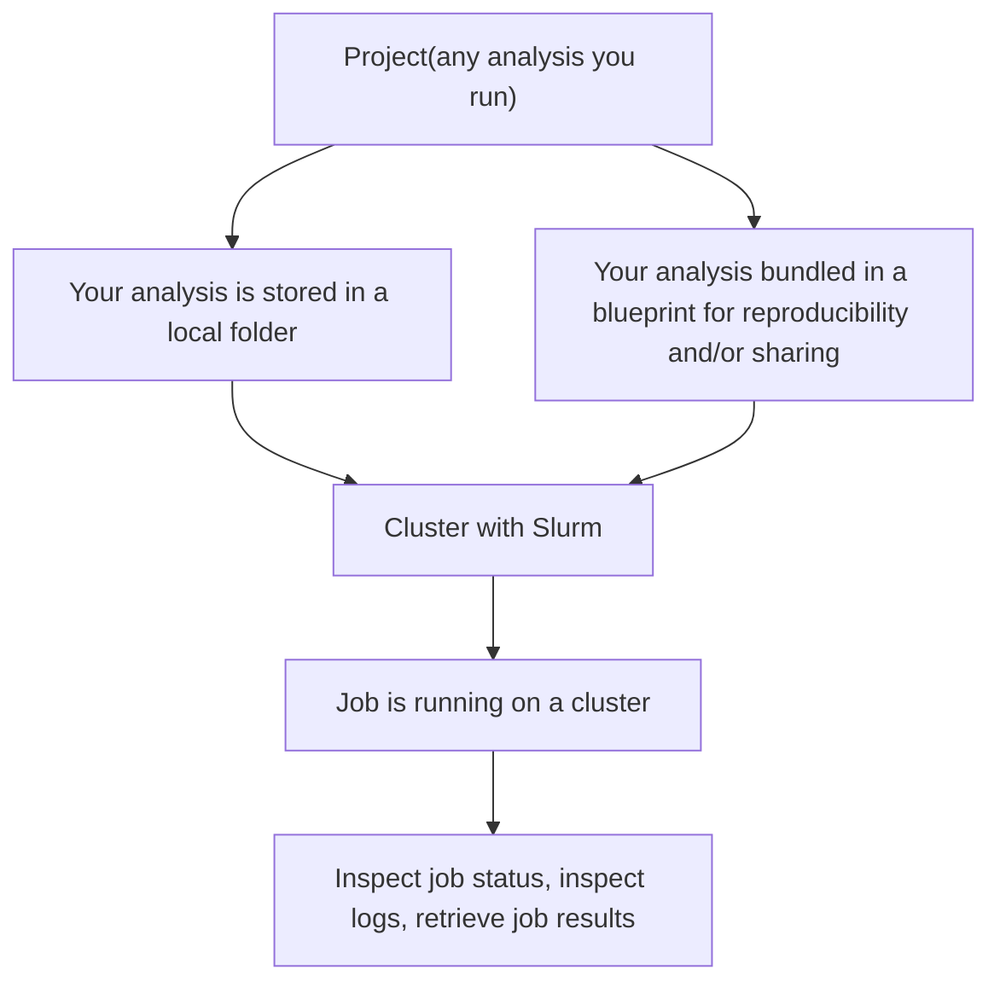

`orbit` is a local-first interface for Slurm.

It is designed for a development workflow where code and data preparation stay on your machine, while compute runs remotely on an HPC cluster. Instead of switching into a remote-only workflow, you can manage runs, monitoring, logs, and result retrieval directly from a local CLI. Practically, it is designed to move all your HPC workflow to your local machine.

## Learn more
- **Jump to [Quickstart](./quickstart.md)** to see what orbit feels like yourself
- **Continue reading** this document to get a deeper understanding of how Orbit works.
- **Learn about [Orbitfile](./orbitfile.md)** to make most use of Orbit.


## Main concepts
Orbit's primary goal is making remote clusters feel like they are just local resources on your machine. For Orbit, **Cluster** is any remote server with Slurm on it (Slurm is the most popular workload scheduler - software that enables scheduling computing workloads on a single server or on a large interconnected fleet of servers). The workflow is centered around these concepts:
- **Project**: any analysis/code you want to run on a cluster.
- **Directory project**: a project that exists as a local folder on your machine.
- **Blueprint project**: a project stored by Orbit as a versioned blueprint.
- **Job**: the result created when a project is submitted to a cluster.
- **Orbitfile**: project configuration file. It controls sync/template/submit/retrieve behavior for project runs, and optionally carries `[project].name` for blueprint builds.

## How to run the code that you have


In practice:
- You run projects organized in local folders or blueprints with `orbit run` - single entrypoint, or
- Run local projects with [orbit job run](./cli/commands/job/orbit-job-run.md), or
- Build and run blueprint projects with [orbit blueprint build](./cli/commands/blueprint/orbit-blueprint-build.md), [orbit blueprint run](./cli/commands/blueprint/orbit-blueprint-run.md);
- Configure both flows with [Orbitfile](./orbitfile.md).

To enable all that, Orbit consists of two main components that are both installed together with Homebrew and run locally on your machine:

- `orbit`: CLI interface for everything described above.
- `orbitd`: the local daemon that performs cluster operations. It runs in the background and does all the heavy-lifting and maintenance such as persisting connections to servers so that you don't need to reconnect to them all the time.

Continue reading to add a cluster and run your first sbatch script through Orbit.
## 1. Install Orbit

The most convenient and error-prone way to install Orbit is through [Homebrew](https://brew.sh):
```bash
brew install vertices-solutions/orbit/orbit
brew services start orbit
```

To check that orbit is installed and ready to run:
```bash
orbit ping
```

## 2. Add your first cluster

Now let's add your cluster to orbit's internal registry. 
It will stay local on your machine.
For example, if you're usually connecting to your cluster at user@example.com:

```bash
orbit cluster add user@example.com
```
You will be prompted for a short name for your cluster and other details.

## 3. Run your first directory job

You want to run a directory job when you just have local code that should execute on your cluster. This is where you start in most cases: you have a folder with scripts/pipelines/compiled code and want to run it remotely.

Orbit assumes that you run jobs from folders on your local machine.
Those folders can be nested to any degree and can contain any amount of code that is specific for your computing needs. Orbit handles file syncing for you.

Create a minimal local job folder:

```bash
mkdir -p ~/orbit-quickstart
cd ~/orbit-quickstart

cat > submit.sbatch <<'SBATCH'
#!/bin/bash
#SBATCH --job-name=orbit-quickstart
#SBATCH --output=results/hello.out

mkdir -p results
echo "hello from $(hostname)" > results/hello.out
SBATCH
```
The code above creates a minimal "hello world" project directory: the sbatch script writes output to `results/hello.out` and prints the work-node hostname.

If your cluster requires extra Slurm directives (for example partition/account), add them to `submit.sbatch` script.

Now you are ready to run your job on the cluster:

```bash
orbit run . --on cluster-name # note: record job-id from this step
orbit job list
orbit job get <job id>
orbit job retrieve <job id> results --output ./out
```

:::tip

Some Slurm clusters require partition and account to be specified; if that's the case - you will see errors in the log.
:::


## 4. Initialize your project Orbitfile

In the same directory:

```bash
orbit init . --name orbit_quickstart
```

This creates an `Orbitfile` with project defaults and initializes `[project].name`.

## 5. Build and run your first blueprint
When you build a blueprint, Orbit:
- checks that Orbitfile is correct and parses it
- saves the blueprint directory in internal representation (a compressed tarball)
- automatically versions your analysis code with date-derived version plus the `latest` pseudo-tag so you can run the newest version easily:

```bash
orbit blueprint build .
orbit blueprint list # shows your blueprint versions
orbit run orbit_quickstart:latest --on <cluster-name>
```

After local changes, run `orbit blueprint build <path>` again to create a new version.
Blueprints are identified by `[project].name` in `Orbitfile`: if you change that value, new builds are associated with a new blueprint.
